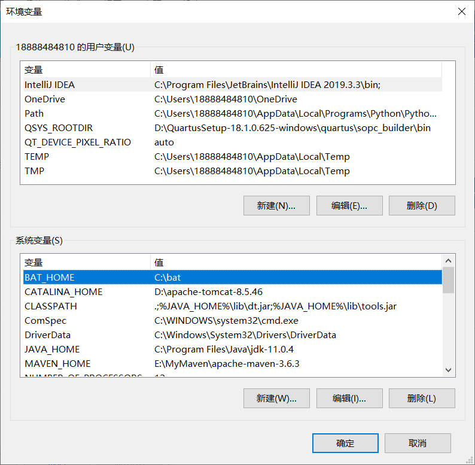

# 变量的设置

### 用户变量的设置

```
setx BAT_HOME C:\bat
pause
```

### 系统变量的设置

```
setx /M BAT_HOME C:\bat
pause
```

当前用户执行时，有可能会提示”错误: 拒绝访问注册表路径。”，如下


要使用管理员身份执行，才能执行成功。




### 追加变量

```bash
rem 对系统变量 Path 追加 新变量 newpath1、newpath2
set currentPath=%Path%
setx "Path" "%currentPath%;newpath1;newpath2" /m
pause
```

### 注意

如果变量已存在，新的变量将会覆盖旧的变量，比如运行下面的批处理：

```
setx /M Path C:\bat
pause
```


这就把 win10系统变量 Path 误删了 。

以下是win10**默认的环境变量设置**，直接复制过去，即可恢复win10环境变量设置。但要注意的是，你原来给其他软件配好的 Path，比如 JDK 的 Path ，已经没有了。别问我怎么知道  (-_- !)    

```
%SystemRoot%\system32;%SystemRoot%;%SystemRoot%\System32\Wbem;%SYSTEMROOT%\System32\WindowsPowerShell\v1.0\;
```

使用下面的批处理

```
setx path "%path%" /m
pause
```

就会出现下面的东西，这就是你原来自定义的 Path ，加上上面的 win10 默认的环境变量 ，可以恢复原设置。原理未知。


# 常用配置

#### jdk-11.0.4

```
//TODO

```

# references

[windows下使用批处理设置环境变量](https://www.cnblogs.com/lhat/p/8717841.html)

[win10误删系统变量path恢复方法](https://blog.csdn.net/claire017/article/details/81563343)

[用setx设置永久环境变量及注意事项](https://blog.csdn.net/fm0517/article/details/52450940)